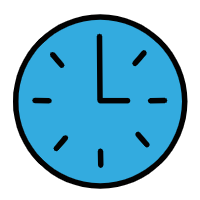

<div align="center">

# ⏳ 时光沙漏瓶 - 你的专属专注守护神 🍅

<!-- 使用更美观的徽章组合 -->
<p align="center">
  <a href="https://github.com/kelongyan/pomodoro-timer/releases">
    
  </a>
  <a href="LICENSE">
    
  </a>
  <a href="#">
    
  </a>
  <a href="#">
    
  </a>
</p>

<!-- GitHub统计徽章 -->
<p align="center">
  <a href="https://github.com/kelongyan/pomodoro-timer/stargazers">
    
  </a>
  <a href="https://github.com/kelongyan/pomodoro-timer/network/members">
    
  </a>
  <a href="https://github.com/kelongyan/pomodoro-timer/blob/main/LICENSE">
    
  </a>
</p>

### 🎮 "别刷手机了，沙漏都等急了！" - 一个会说话的番茄钟

<p align="center">
  
</p>

## 🌟 **嘿，摸鱼达人！你的生产力需要抢救一下~**

[🎯 沙漏の魔法](#-沙漏の魔法) • [🚀 3秒启动](#-3秒启动立刻开干) • [🎮 酷炫功能](#-酷炫功能亮瞎眼) • [🎨 界面展示](#-界面展示美美哒) • [⌨️ 键盘侠模式](#️-键盘侠模式起飞) • [🛠️ 代码の秘密](#️-代码の秘密宝库) • [🤝 加入我们](#-加入我们一起玩)

</div>

---

## 🎯 **沙漏の魔法：为啥这个番茄钟不一样？**

> ⚡ **传统番茄钟**：冷冰冰的计时器
> ⚡ **我们的沙漏瓶**：有灵魂的专注伙伴！

### 🍅 **番茄工作法？我们把它变有趣了！**
```
💡 25分钟专注 + 5分钟小憩 = 1个完美番茄
💡 4个番茄 = 15分钟摸鱼...啊不，是长休息！
💡 沙漏动画 = 看着时间"流走"的奇妙体验
```

### ✨ **沙漏の五大魔法**
1. **🌈 变色龙主题** - 白天浅色护眼，夜晚深色不瞎
2. **🎵 灵魂音效** - 风铃、闹钟，还是...静音（摸鱼必备）
3. **📱 百变小樱** - 手机电脑平板，哪里都能用
4. **🧠 记忆大师** - 自动记住你的习惯设置
5. **🪄 沙漏动画** - 时间像沙子一样流走的视觉盛宴

---

## 🚀 **3秒启动：立刻开干！**

### **🎯 选项A：懒人专属（最快）**
```bash
# 1. 打开网页就行，不用安装！
# 2. 双击 index.html 文件
# 3. 开始专注，就是这么简单！
```

### **🎯 选项B：极客模式（装逼专用）**
```bash
# 克隆这个超酷的项目
git clone https://github.com/kelongyan/pomodoro-timer.git

# 进入魔法领域
cd pomodoro-timer

# 启动本地服务器（假装很专业）
python -m http.server 8000

# 访问你的专属沙漏瓶
# 👉 http://localhost:8000 👈
```

### **🎯 选项C：在线体验（摸鱼神器）**
```
在线访问：https://kelongyan.github.io/pomodoro-timer/ （如果已部署）
适合：办公室、咖啡厅、床上...任何你想摸鱼的地方
```

---

## 🎮 **酷炫功能：亮瞎眼！**

### **🎨 视觉盛宴**
- **⏳ 动感沙漏**：看着时间像沙子一样流淌，治愈强迫症
- **🎨 双色皮肤**：浅色像清晨的阳光，深色像夜晚的星空
- **🌈 情绪配色**：
  - 🟠 专注橙：像番茄一样鲜艳
  - 🟢 休息绿：像草地一样放松  
  - 🔵 长休蓝：像大海一样深邃

### **🎵 听觉享受**
- **🔔 风铃**：温柔提醒，不吓人
- **🛎️ 铃铛**：传统经典，有仪式感  
- **🔇 静音**：摸鱼专用，老板听不到

### **🤖 智能助手**
- **💾 自动记忆**：记住你的所有设置
- **📊 番茄统计**：看看今天又干掉几个番茄
- **🔄 无缝切换**：手机电脑随便换，数据跟着走

---

## 🎨 **界面展示：美美哒~**

### **🖥️ 桌面模式：大屏沉浸**
```
┌─────────────────────────────────────────────────────────┐
│  🌙 夜色模式 | ⛶ 全屏摸鱼 | ⚙️ 个性化设置               │
├─────────────────────────────────────────────────────────┤
│                                                         │
│      🎯 我要专注！    ☕ 小憩一下    🌴 躺平休息         │
│                                                         │
│        ⏳ 沙漏在滴答...          ⏱️ 25:00                │
│        [██████████]             ──────────              │
│        "别分心！"                ▶️ 开始  ⏸️ 暂停        │
│                                                         │
└─────────────────────────────────────────────────────────┘
```

### **📱 手机模式：一手掌握**
- 🤏 触摸大按钮，不怕手抖
- 📱 自适应布局，怎么转都好看  
- 🎨 简洁模式，小屏也清晰

---

## ⚙️ **使用指南：手把手教你成为番茄大师**

### **🍅 第一步：种下你的第一个番茄**
1. 点击 **🎯 我要专注！** 按钮
2. 按下 **空格键** 或点击 **▶️ 开始**
3. 看着沙漏慢慢变空...
4. **专心！专心！专心！**（重要的事情说三遍）

### **☕ 第二步：享受小憩时光**
- 专注结束后，**自动**进入5分钟休息
- 喝口水，伸个懒腰，看看窗外
- **禁止**打开社交媒体！（沙漏会生气的）

### **🌴 第三步：长休息的狂欢**
- 每完成4个番茄，奖励15分钟长休息
- 可以起来走动、吃点零食、聊聊天
- 或者...继续摸鱼？（小声说）

### **⚙️ 第四步：个性化你的沙漏**
点击 **⚙️ 设置** 解锁：
- **⏰ 自定义时间**：1-60分钟，随你定
- **🎵 选择音效**：温柔风铃还是经典铃铛？
- **🎨 切换主题**：白天模式 or 夜晚模式？
- **🔄 一键重置**：玩坏了就恢复出厂设置

---

## ⌨️ **键盘侠模式：起飞！**

| 按键 | 功能 | 装逼指数 |
|------|------|----------|
| **空格键** | 开始/暂停 | ⭐⭐⭐⭐⭐ |
| **R** | 重置番茄 | ⭐⭐⭐⭐ |
| **S** | 跳过阶段 | ⭐⭐⭐⭐ |
| **F** | 全屏沉浸 | ⭐⭐⭐⭐⭐ |
| **T** | 切换主题 | ⭐⭐⭐ |
| **ESC** | 退出/关闭 | ⭐⭐⭐ |

**💡 小贴士**：熟练使用快捷键，同事会觉得你是时间管理大师！

---

## 📁 **代码の秘密：宝库揭秘**

### **🏗️ 项目架构：小而美的艺术**
```
时光沙漏瓶/
├── 📄 index.html          # 魔法入口
├── 📁 css/
│   └── styles.css        # 颜值担当（1500+行美妆）
├── 📁 js/                # 大脑核心
│   ├── index.js          # 总指挥
│   ├── state.js          # 记忆中枢
│   ├── timer.js          # 时间魔法
│   ├── ui.js             # 颜值管理
│   ├── events.js         # 耳朵和眼睛
│   ├── audio.js          # 声音魔法
│   ├── notification.js   # 提醒小助手
│   └── storage.js        # 记忆面包
└── 📄 README.md          # 这本说明书
```

### **💻 技术亮点**
- **✨ 纯原生**：零依赖，运行如飞
- **🎯 模块化**：代码清晰，维护简单
- **🌈 响应式**：从手机到4K屏，统统搞定
- **💾 本地存储**：你的数据你做主
- **🔔 Web通知**：贴心提醒，不怕错过

### **🎨 设计哲学**
- **简约不简单**：功能强大但界面清爽
- **动感不花哨**：恰到好处的动画
- **实用不枯燥**：用趣味性提升使用频率

---

## 🛠️ **开发指南：想自己改改？**

### **🔧 环境准备**
```bash
# 1. 克隆代码
git clone https://github.com/kelongyan/pomodoro-timer.git

# 2. 安装...等等，不用安装！
# 3. 直接开搞！
```

### **📝 代码风格**
- **变量命名**：像给宠物起名一样用心
- **注释**：像给朋友解释一样详细  
- **提交信息**：像写日记一样真诚

### **🚀 快速调试**
```javascript
// 打开浏览器开发者工具
// 1. F12 是你的好朋友
// 2. Console里会有沙漏的悄悄话
// 3. 随便改，玩坏了可以重置
```

---

## 🤝 **加入我们：一起玩！**

### **🎯 想贡献代码？**
1. **🍴 Fork一下**：先拿个盘子
2. **🌿 开个分支**：`git checkout -b feature/超酷功能`
3. **💾 提交更改**：`git commit -m '添加了会跳舞的沙漏'`
4. **🚀 推送到GitHub**：`git push origin feature/超酷功能`
5. **🎉 发起Pull Request**：等我们给你点赞！

### **🐛 发现Bug了？**
- **🎯 小Bug**：直接提Issue，我们有强迫症
- **💥 大Bug**：先谢谢大佬发现！我们跪着修
- **💡 新想法**：尽管提，万一实现了呢？

### **🌟 待开发の梦（欢迎认领）**
- [ ] **🎨 更多主题**：彩虹色？渐变色？你说了算！
- [ ] **📊 数据导出**：把番茄数据做成漂亮图表
- [ ] **📅 番茄日历**：看看这个月摸了多少鱼
- [ ] **🎵 自定义音效**：上传你的专属提醒音
- [ ] **📱 PWA支持**：离线也能用，真正的摸鱼神器

---

## 📄 **许可证：随便用，别客气！**

本项目采用 **MIT许可证** - 意思是：
- ✅ 可以随便用
- ✅ 可以随便改  
- ✅ 可以商用
- ✅ 唯一要求：保留原许可证声明

**开源精神**：代码共享，世界更美好！ ✨

---

## 🙏 **感谢の心：没有他们就没有沙漏瓶**

- **🍅 Francesco Cirillo**：番茄工作法之父，谢谢你让我们高效（摸鱼）
- **👥 所有贡献者**：你们的代码让沙漏更闪亮
- **🌍 开源社区**：站在巨人的肩膀上看得更远
- **💻 每一个使用者**：你们的专注让我们有动力

特别感谢：**咖啡、深夜、和无数个调试的夜晚** ☕🌙

---

## 📞 **联系我们：沙漏の回音**

- **🐛 Bug报告**：[GitHub Issues](https://github.com/kelongyan/pomodoro-timer/issues)
  - "沙漏不转了！" 
  - "颜色太丑了！"
  - "我想要会说话的沙漏！"
  
- **💡 功能建议**：同上，随便提
- **💌 私信作者**：[kelong.yan@foxmail.com](mailto:kelong.yan@foxmail.com)
  - 主题建议："关于沙漏瓶的奇思妙想"
  - 紧急事项："救命！沙漏成精了！"

---

<div align="center">

## 🎉 **恭喜你读完了！现在该干嘛？**

**👉 当然是：打开沙漏瓶，开始你的第一个番茄！ 👈**

<p align="center">
  <a href="https://github.com/kelongyan/pomodoro-timer">
    
  </a>
  <a href="https://kelongyan.github.io/pomodoro-timer/">
    
  </a>
  <a href="mailto:kelong.yan@foxmail.com">
    
  </a>
</p>

**如果这个项目让你的专注力提升了1%，请给它一个 ⭐ Star！**

[⬆️ 回到顶部](#-时光沙漏瓶---你的专属专注守护神-) • [🎮 开始使用](#-3秒启动立刻开干) • [🤝 加入开发](#-加入我们一起玩)

---

**✨ 时光沙漏瓶 - 让每一秒都有意义 ✨**

*"别让时间像沙子一样从指间溜走，用沙漏瓶抓住它！"*

<p align="center">
  <sub>Made with ❤️ by <a href="https://github.com/kelongyan">Kelong Yan</a></sub>
</p>

</div>